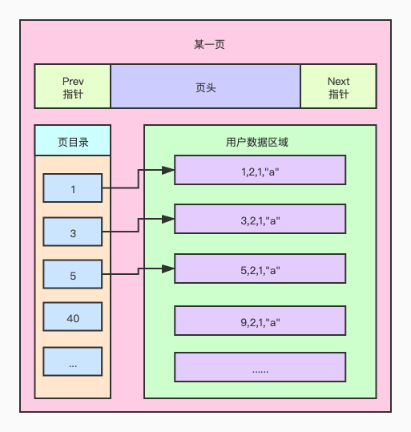
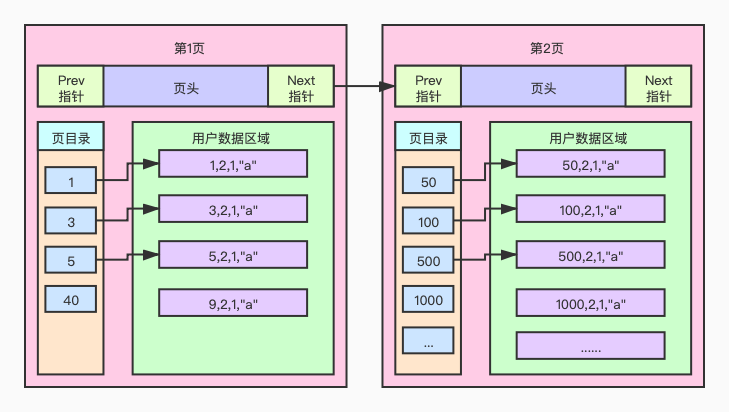
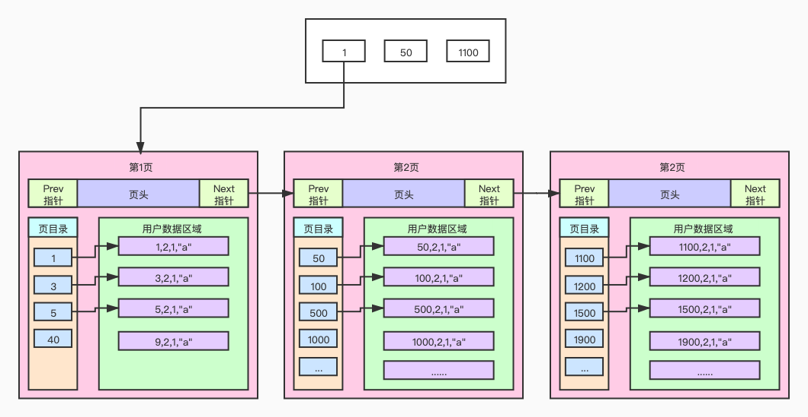
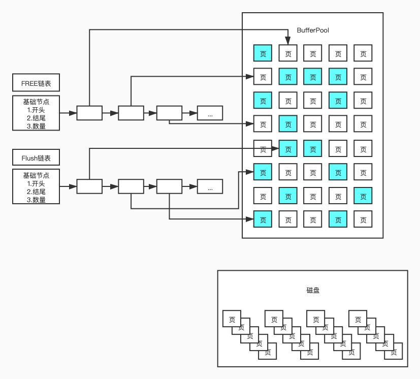
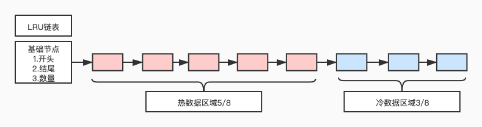

= SpringBoot JPA
:pdf-themesdir: theme
:pdf-fontsdir: fonts
:pdf-theme: KaiGenGothicCN

:icons: font

== spring-boot-jpa 索引

通过注解自动创建索引

== spring-boot-jpa 转换器

数据库中实体对象和基本对象的相互转换

== spring-boot-jpa 投影

DO 转换成 VO

== spring-boot-jpa 事件

领域事件

== spring-boot-jpa jpql

面向对象的查询 SQL

== spring-boot-jpa 事务

重难点

== spring-boot-jpa 一对一

== spring-boot-jpa 一对多

== spring-boot-jpa 多对多

== spring-boot-jpa 缓存

一级缓存,二级缓存,应用层缓存

== spring-boot-jpa 动态查询-specification

动态查询

== spring-boot-jpa 动态查询-querydsl

动态查询

== 深入了解 MySQL

=== InnoDB

=== InnoDB 索引原理

=== MySQL 的存储结构

=== MySQL 的查询过程

=== MySQL 存储结构

=== 在线 DDL

==== 在线直接 DDL 的几种限制

==== 大表 DDL 的解决方式

== MySQL 查询优化技术

MySQL把链表按比例分成两截:

. 热数据区域,用来存放使用频率非常高的数据页;

. 冷数据区域,用来存放使用频率不是很高的数据页;

. 通过 innodb_old_blocks_pct 可以调整区域比例.

使用 UPDATE 语句时,会生产一个 redo_log redo_log 持久化 innodb_flush_log_at_trx_commit

|===
^|配置值 ^|描述

^|0
|表示事务提交时,不利己对 redo_log 进行持久化,这个任务交给后台线程去做

^|1
|表示事务提交时,立即把 redo_log 进行持久化

^|2
|表示事务提交时,立即将 redo_log 写到操作系统的缓冲区,并不会直接将 redo_log 进行持久化,这种情况下,如果数据库挂了,操作系统没有挂,那么事务的持久性还是可以保证的
|===

查看事务的隔离级别

[source,sql]
====
select @@tx_isolation; -- 查看当前 session 事务隔离级别;

select @@global.tx_isolation;
====

设置事务的隔离级别

-- read uncommitted
-- read committed
-- repeatable read
-- serializable

[source,sql]
====
SHOW GLOBAL VARIABLES LIKE '%innodb_buffer_pool_size%'; -- 查看 buffer pool 大小,默认是 128M

SHOW GLOBAL VARIABLES LIKE '%innodb_old_blocks_pct%'; -- LRU 链表冷数据区域配置,默认 37

SHOW GLOBAL VARIABLES LIKE '%innodb_old_blocks_time%'; -- LRU 链表冷区域的数据隔多久可以放入到热区域
====

[source,sql]
====
set session transaction isolation level read uncommitted;

set global transaction isolation level repeatable read;

set global transaction isolation level read uncommitted;
====

== 版本链

对于使用 innodb 存储引擎的表来说,它的聚簇索引记录中都包含两个必要的隐藏列(row_id并不是必要的,我们创建的表中有主见或者非 NULL 唯一建是都不会包含 row_id 列):

. trx_id: 每次对某条记录进行改动时,都会把对应的事务 id 赋值给 trx_id 隐藏列.
. roll_pointer: 每次对某条记录进行改动时,这个隐藏列会存储一个指针,可以通过这个指针找到该记录修改前的信息.

== ReadView

对于使用 read uncommitted 隔离级别的事务来说,直接读取记录的最新版本就好了,对于使用 serializable 隔离级别的事务来说,使用加锁的方式来访问记录.对于使用 read committed 和 repeatable read 隔离级别的事务来说,就需要用到我们上边所说的版本链了,核心问题就是:
需要判断一下版本链中的哪个版本是当前事务可见的.

ReadView 中主要包含 4 个比较重要的内容:

. m_ids: 表示在生产 ReadView 时,当前系统中活跃的读写事务的事务 id 列表;
. min_trx_id: 表示在生成 ReadView 时当前系统中活跃的事务中最小的事务 id,也就是 m_ids 中最小值;
. max_trx_id: 表示生产 ReadView 时系统中应该分配给下一个事务的 id 值;
. creator_trx_id: 表示生成该 ReadView 的事务的事务 id.

[IMPORTANT]
====
注意: max_trx_id 并不是 m_ids 中的最大值,事务 id 是递增分配的.比方说现有 id 为 1,2,3 这个三个事务,之后 id 为 3 的事务提交了, 那么一个新的读事务在生成 ReadView 时, m_ids 就包括了 1和 2, min_trx_id 的值就是 1,max_trx_id 的值就是 4.
====

有了这个 ReadView, 这样在访问某条记录时,只需要按照下边的步骤判断记录的某个版本是否可见:

. 如果被访问版本的 trx_id 属性值与 ReadView 中 creator_trx_id 值相同, 意味着当前事务在访问它自己修改过的记录,所以该版本可以被当前事务访问.

. 如果被访问版本的 trx_id 属性值小于 ReadView 中的 min_trx_id 值,表示生成该版本的事务在当前事务生成 ReadView 前已经提交,所以该版本可以被当前事务访问.

. 如果被访问版本的 trx_id 属性值大于 ReadView 中 max_trx_id 值,表示生成该版本的事务在当前事务生成 ReadView 后才开启,所以该版本不可以被当前事务访问.

. 如果被访问版本的 trx_id 属性值在 ReadView 中的 min_trx_id 和 max_trx_id 之间,那就需要判断一下 trx_id 属性值是不是在 m_ids 列表中,如果在,说明创建 ReadView 时生成了该版本的事务还是活跃的,该版本不可以被访问; 如果不在,说明创建 ReadView 时, 生成该版本的事务已经被提交,该版本可以被访问.

行锁

LOCK_REC_NOT_GAP: 单个行记录上的锁.
LOCk_GAP: 间隙锁,锁定一个范围,但不包括记录本身.GAP 锁的目的,是为了防止同一事物的两次当前读,出现幻读的情况.
LOCK_ORDINARY: 锁定一个范围,并且锁定记录本上.对于行的查询,都是采用该方法,主要的目的是解决幻读的问题.

== redo log 简介

[TIP]
====
redo log 属于存储引擎侧的技术, 主要是为了解决 innodb 事务的问题, 为了保证一致性, 用户提交完事务后, mysql 会将用户提交的数据写到 redo log 中, 等 redo log 写入成功后给用户返回成功.
====

[qanda]
为什么写入的是 redo log 不直接写磁盘::
mysql

== 查看 redo log 相关的配置.

查看 redo log 的文件大小, 默认是 48M.
`SHOW GLOBAL VARIABLES LIKE '%innodb_log_file_size%'`;

查看 redo log 的个数:
`SHOW GLOBAL VARIABLES LIKE '%innodb_log_files_in_group%'`;

写 redo log 时机配置项, 默认是 1:
`SHOW GLOBAL VARIABLES LIKE '%innodb_flush_log_at_trx_commit%';`

|===
|配置值 |描述

|0
|表示事物提交时,不不立即对 redo log 进行持久化,这个任务交给后台线程去做

|1
|表示事务提交时,立即把 redo log 进行持久化.默认值是 1.

|2
|表示事务提交时,立即将 redo log 写到操作系统的缓存区,并不会直接将 redo log 进行持久化. +
这种情况下, 如果数据库挂了,操作系统没挂,那么事务的持久性还是可以保证的.
|===

write -> 写到内存中(操作系统的缓存)

flush -> 写到磁盘中

